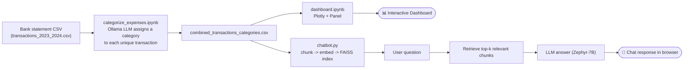

# 💰 IntelliSpend AI

**AI-powered personal finance assistant that automatically categorizes your transactions, visualizes your spending, and lets you chat with your own financial data.**

IntelliSpend AI combines a local LLM (via [Ollama](https://ollama.com/)), retrieval-augmented generation (RAG), and interactive Plotly/Panel dashboards to turn a raw bank statement CSV into clear, actionable financial insight — no manual spreadsheet tagging required.

<p align="left">
  
  
  
  
  
</p>

---

## ✨ Overview

Most budgeting apps require you to manually tag every transaction. IntelliSpend AI removes that friction by using an LLM to read your bank statement and infer a spending category for each transaction on its own. Once categorized, the data feeds two things:

1. **An interactive visualization dashboard** — pie/donut breakdowns and monthly trend bar charts of income vs. expenses.
2. **A retrieval-augmented chatbot** — ask natural-language questions about your finances ("How much did I spend on food last month?") and get answers grounded in your actual transaction history.

## 🚀 Features

| Feature | Description | Powered by |
|---|---|---|
| 🏷️ **Automated Expense Categorization** | Reads raw transaction descriptions from a CSV and assigns a short spending category (e.g. *Rent*, *Groceries*, *Entertainment*) using a local LLM — no manual labeling. | `Ollama` (LLaMA 2), `pandas` |
| 💬 **Conversational Financial Chatbot** | A Flask web app where users ask free-form questions about their finances. Transaction data is chunked, embedded, and retrieved via FAISS before being passed to the LLM as context (RAG). | `LangChain`, `FAISS`, `OpenAIEmbeddings`, `HuggingFace` (Zephyr-7B) |
| 📊 **Interactive Visualization Dashboard** | Donut chart of expense breakdown by category and a color-scaled bar chart of spend per month, assembled into tabbed views by year. | `Plotly Express`, `Panel` |

## 🏗️ How it works



## 📊 Sample Data Visualizations

The dashboard notebook (`dashboard.ipynb`) generates the charts below from your categorized transactions. The samples here are built from **synthetic placeholder data** so you can see the exact look and feel before plugging in your own statement.

> 🔗 The three charts below are rendered live via [QuickChart.io](https://quickchart.io) — a free public charting API. The chart data is encoded directly in each image URL, so these links work immediately with no upload or `assets/` folder required. The final screenshot links straight to `Screenshot.png` in this repo's `main` branch.

### Expense Breakdown by Category

Donut chart showing the share of total spend per category for a given year, with the total amount in the center — mirrors `make_pie_chart()`.

![Sample expense breakdown donut chart](https://quickchart.io/chart?c=%7B%22type%22%3A%20%22doughnut%22%2C%20%22data%22%3A%20%7B%22labels%22%3A%20%5B%22Rent%22%2C%20%22Groceries%22%2C%20%22Dining%20Out%22%2C%20%22Transportation%22%2C%20%22Entertainment%22%2C%20%22Subscriptions%22%2C%20%22Health%20%26%20Fitness%22%2C%20%22Shopping%22%2C%20%22Travel%22%2C%20%22Utilities%22%5D%2C%20%22datasets%22%3A%20%5B%7B%22data%22%3A%20%5B1200%2C%20430%2C%20260%2C%20180%2C%20140%2C%2095%2C%20120%2C%20310%2C%20220%2C%20150%5D%2C%20%22backgroundColor%22%3A%20%5B%22%2366c2a5%22%2C%20%22%23fc8d62%22%2C%20%22%238da0cb%22%2C%20%22%23e78ac3%22%2C%20%22%23a6d854%22%2C%20%22%23ffd92f%22%2C%20%22%23e5c494%22%2C%20%22%23b3b3b3%22%2C%20%22%238dd3c7%22%2C%20%22%23fb8072%22%5D%7D%5D%7D%2C%20%22options%22%3A%20%7B%22plugins%22%3A%20%7B%22title%22%3A%20%7B%22display%22%3A%20true%2C%20%22text%22%3A%20%22Expense%20Breakdown%202024%20%28%5Cu20ac3%2C105%20total%29%22%2C%20%22font%22%3A%20%7B%22size%22%3A%2018%7D%7D%2C%20%22legend%22%3A%20%7B%22position%22%3A%20%22right%22%7D%7D%7D%7D&width=650&height=500&backgroundColor=white)

### Monthly Expense Trend

Color-scaled bar chart of total spend per month — mirrors `make_monthly_bar_chart()`. Darker bars indicate higher-spend months, making outliers (like a big one-off purchase) easy to spot at a glance.

![Sample monthly expense bar chart](https://quickchart.io/chart?c=%7B%22type%22%3A%20%22bar%22%2C%20%22data%22%3A%20%7B%22labels%22%3A%20%5B%22Jan%22%2C%20%22Feb%22%2C%20%22Mar%22%2C%20%22Apr%22%2C%20%22May%22%2C%20%22Jun%22%2C%20%22Jul%22%2C%20%22Aug%22%2C%20%22Sep%22%2C%20%22Oct%22%2C%20%22Nov%22%2C%20%22Dec%22%5D%2C%20%22datasets%22%3A%20%5B%7B%22label%22%3A%20%22Expense%20%28%5Cu20ac%29%22%2C%20%22data%22%3A%20%5B1850%2C%202100%2C%201730%2C%201990%2C%202350%2C%202600%2C%204000%2C%202200%2C%201900%2C%202050%2C%202400%2C%202750%5D%2C%20%22backgroundColor%22%3A%20%5B%22%23fee8c8%22%2C%20%22%23fdd49e%22%2C%20%22%23fee8c8%22%2C%20%22%23fdd49e%22%2C%20%22%23fdbb84%22%2C%20%22%23fc8d59%22%2C%20%22%23b30000%22%2C%20%22%23fdd49e%22%2C%20%22%23fee8c8%22%2C%20%22%23fdd49e%22%2C%20%22%23fdbb84%22%2C%20%22%23fc8d59%22%5D%7D%5D%7D%2C%20%22options%22%3A%20%7B%22plugins%22%3A%20%7B%22title%22%3A%20%7B%22display%22%3A%20true%2C%20%22text%22%3A%20%22Expense%20per%20Month%22%2C%20%22font%22%3A%20%7B%22size%22%3A%2018%7D%7D%2C%20%22legend%22%3A%20%7B%22display%22%3A%20false%7D%7D%2C%20%22scales%22%3A%20%7B%22y%22%3A%20%7B%22title%22%3A%20%7B%22display%22%3A%20true%2C%20%22text%22%3A%20%22Amount%20%28%5Cu20ac%29%22%7D%7D%7D%7D%7D&width=750&height=420&backgroundColor=white)

### Income vs. Expense

An additional view combining both income and expense trends over the year, useful for spotting months where spending exceeded income.

![Sample income vs expense chart](https://quickchart.io/chart?c=%7B%22type%22%3A%20%22line%22%2C%20%22data%22%3A%20%7B%22labels%22%3A%20%5B%22Jan%22%2C%20%22Feb%22%2C%20%22Mar%22%2C%20%22Apr%22%2C%20%22May%22%2C%20%22Jun%22%2C%20%22Jul%22%2C%20%22Aug%22%2C%20%22Sep%22%2C%20%22Oct%22%2C%20%22Nov%22%2C%20%22Dec%22%5D%2C%20%22datasets%22%3A%20%5B%7B%22label%22%3A%20%22Income%22%2C%20%22data%22%3A%20%5B3200%2C%203200%2C%203200%2C%203200%2C%203200%2C%203200%2C%203200%2C%203200%2C%203200%2C%203200%2C%203200%2C%203200%5D%2C%20%22borderColor%22%3A%20%22%232ca02c%22%2C%20%22backgroundColor%22%3A%20%22%232ca02c33%22%2C%20%22fill%22%3A%20true%2C%20%22tension%22%3A%200.2%7D%2C%20%7B%22label%22%3A%20%22Expense%22%2C%20%22data%22%3A%20%5B1850%2C%202100%2C%201730%2C%201990%2C%202350%2C%202600%2C%204000%2C%202200%2C%201900%2C%202050%2C%202400%2C%202750%5D%2C%20%22borderColor%22%3A%20%22%23d62728%22%2C%20%22backgroundColor%22%3A%20%22%23d6272833%22%2C%20%22fill%22%3A%20true%2C%20%22tension%22%3A%200.2%7D%5D%7D%2C%20%22options%22%3A%20%7B%22plugins%22%3A%20%7B%22title%22%3A%20%7B%22display%22%3A%20true%2C%20%22text%22%3A%20%22Income%20vs.%20Expense%20%282024%29%22%2C%20%22font%22%3A%20%7B%22size%22%3A%2018%7D%7D%2C%20%22legend%22%3A%20%7B%22position%22%3A%20%22top%22%7D%7D%2C%20%22scales%22%3A%20%7B%22y%22%3A%20%7B%22title%22%3A%20%7B%22display%22%3A%20true%2C%20%22text%22%3A%20%22Amount%20%28%5Cu20ac%29%22%7D%7D%7D%7D%7D&width=750&height=400&backgroundColor=white)

### Live App Screenshot

This is what the actual Plotly/Panel dashboard tab looks like when rendered with real categorized transaction data:


## 🛠️ Tech Stack

- **Language:** Python
- **Web framework:** Flask
- **LLM orchestration:** LangChain
- **LLMs:** Ollama (LLaMA 2) for categorization, HuggingFace Zephyr-7B-beta for chat
- **Embeddings & retrieval:** OpenAI Embeddings, FAISS
- **Data processing:** pandas
- **Visualization:** Plotly Express, Panel

## 📁 Project Structure

```
IntelliSpend-AI/
├── categorize_expenses.ipynb   # LLM-based transaction categorization pipeline
├── dashboard.ipynb             # Plotly/Panel visualization dashboard
├── chatbot.py                  # Flask app: RAG chatbot over financial data
├── templates/
│   └── bot_1.html              # Chatbot front-end
├── requirements.txt            # Python dependencies
└── Screenshot.png              # Dashboard preview
```

## ⚙️ Installation

```bash
# Clone the repository
git clone https://github.com/faizanalam-1457/IntelliSpend-AI.git
cd IntelliSpend-AI

# Create a virtual environment (recommended)
python3 -m venv venv
source venv/bin/activate      # On Windows: venv\Scripts\activate

# Install dependencies
pip install -r requirements.txt

# The dashboard/categorization notebooks additionally need:
pip install pandas plotly panel langchain_community
```

You'll also need:
- [Ollama](https://ollama.com/download) installed locally, with the `llama2` model pulled (`ollama pull llama2`), for expense categorization.
- An **OpenAI API key** (for embeddings) and a **HuggingFace API token** (for the chat LLM) — see [Configuration](#-configuration) below.

## ▶️ Usage

### 1. Categorize your transactions

1. Place your bank statement as `transactions_2023_2024.csv` in the project root (must include a `Name / Description` column).
2. Open and run `categorize_expenses.ipynb` end to end. This calls the local Ollama LLM to assign a category to each unique transaction and writes `combined_transactions_categories.csv`.

### 2. Explore the dashboard

1. Open `dashboard.ipynb` and run all cells.
2. It reads `combined_transactions_categories.csv`, derives `Year`/`Month` columns, and renders the donut and bar charts shown above, grouped into tabs by year via Panel.

### 3. Chat with your data

```bash
python chatbot.py
```

Then open `http://127.0.0.1:5000` in your browser, type a question about your finances, and get an answer grounded in a `complete_financial_analysis.txt` document via RAG.

## 🔧 Configuration

`chatbot.py` currently expects two credentials to be set inline in the file — for real use, replace these with environment variables instead of hardcoding secrets:

```python
embeddings_model = OpenAIEmbeddings(openai_api_key="your_openai_key")
huggingface_api_token = "your_huggingface_openai_token"
```

Recommended: load them from the environment instead, e.g.

```python
import os
embeddings_model = OpenAIEmbeddings(openai_api_key=os.environ["OPENAI_API_KEY"])
huggingface_api_token = os.environ["HUGGINGFACEHUB_API_TOKEN"]
```

You'll also need a `complete_financial_analysis.txt` file in the project root — a plain-text export/summary of your financial data — since `chatbot.py` loads and chunks this file to build its retrieval index.

## 🗺️ Roadmap Ideas

- Move hardcoded API keys to environment variables / `.env`
- Feed `combined_transactions_categories.csv` directly into the chatbot's retriever instead of a separate manually-maintained text file
- Add year-over-year comparison views to the dashboard
- Package the dashboard as a standalone Panel/Flask app instead of a notebook

## 🤝 Contributing

Issues and pull requests are welcome. If you add a feature, consider updating the sample visualizations in this README to match.

## 📄 License

No license file is currently included in this repository — check with the repository owner before reuse.
